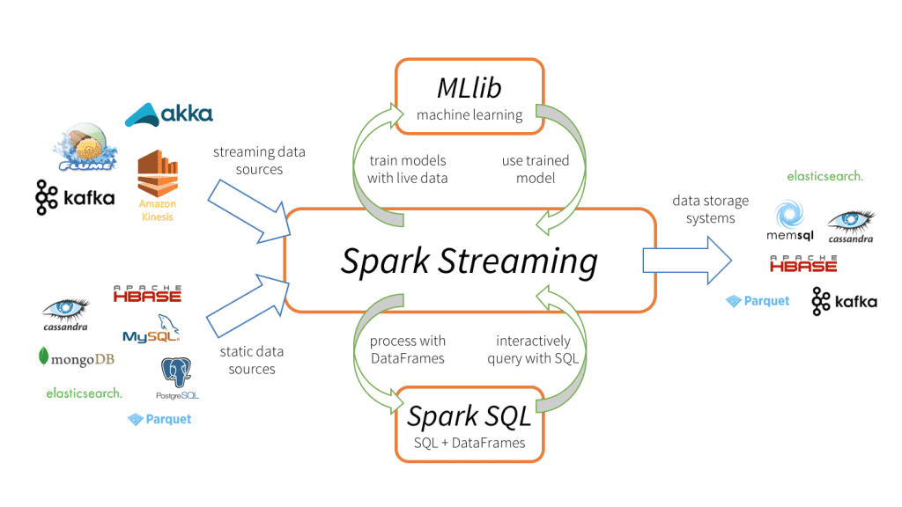
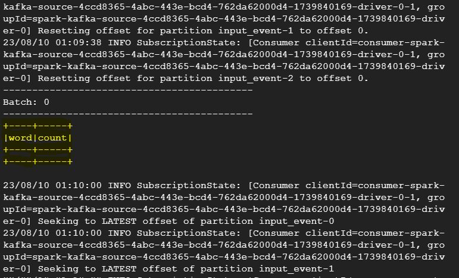

# Real-time Data Processing with Apache Kafka, Spark Streaming, and PySpark: A Practical Guide

## Introduction
This guide provides a step-by-step walkthrough to set up a real-time data processing pipeline using Apache Kafka, Spark Streaming, and PySpark. By combining these technologies, you'll be able to process streaming data efficiently and gain valuable insights in real time.

[Real-time Data Processing (Google Slides)](https://docs.google.com/presentation/d/1VuJ2gLl3MWYkCODy_INHA_bGpvZQleQTkA0drppMLNY/edit?usp=sharing)

## Design


The architecture consists of the following components:
* **Apache Kafka:** A distributed event streaming platform that facilitates the ingestion and distribution of data streams.
* **Spark Streaming:** A micro-batch processing framework built on Apache Spark for processing real-time data streams.
* **PySpark:** The Python API for Apache Spark, enabling you to build data processing applications using Python.
* **Data Pipeline:** Kafka acts as a source for Spark Streaming, which processes data in mini-batches and performs analytics.
* **Output:** The processed data can be sent to various sinks for storage, visualization, or further analysis.

## Implementation (Kafka Example)
1. **Download and Extract Kafka:**
   ```script
   # Connect to your Dataproc cluster using SSH.
   wget https://downloads.apache.org/kafka/3.5.1/kafka_2.12-3.5.1.tgz
   tar -xvf kafka_2.12-3.5.1.tgz
   ```

2. **Install Dependencies:**
   ```script
   # Install required Python packages.
   pip3 install msgpack kafka-python
   ```

3. **Start Zookeeper and Kafka Broker:**
   ```script
   # Start Zookeeper
   cd kafka_2.12-3.5.1/
   bin/zookeeper-server-start.sh config/zookeeper.properties
   ```
   ```
   # Start Kafka broker in a new (second) terminal.
   cd kafka_2.12-3.5.1/
   bin/kafka-server-start.sh config/server.properties
   ```

4. **Create Kafka Topic:**
   ```script
   cd kafka_2.12-3.5.1/
   # Create Kafka topic in a new (third) terminal.
   bin/kafka-topics.sh --create --topic input_event --bootstrap-server localhost:9092 --partitions 3 --replication-factor 1
   ```

5. **Create and Run Kafka Consumer:**
   * Create a Python script in third terminal named `consumer.py` and implement the consumer logic using the `kafka-python` library.
   ```script
   vi consumer.py
   ```
   * Run the consumer script:
   ```script
   python3 consumer.py
   ```

6. **Create and Run Kafka Producer:**
   * Create a Python script in a new (fourth) terminal named `producer.py` and implement the producer logic using the `kafka-python` library.
   ```script
   vi producer.py
   ```
   * Run the producer script:
   ```script
   python3 producer.py
   ```


## Test (Kafka Example)
* Monitor the consumer terminal to see messages consumed from the Kafka topic.
* Verify that messages sent by the producer are successfully received and printed by the consumer.


## Implementation (Kafka + Spark Streaming + PySpark )

1. **Start Zookeeper and Kafka Broker:**
   ```script
   # Start Zookeeper
   cd kafka_2.12-3.5.1/
   bin/zookeeper-server-start.sh config/zookeeper.properties
   ```
   ```
   # Start Kafka broker in a new (second) terminal.
   cd kafka_2.12-3.5.1/
   bin/kafka-server-start.sh config/server.properties
   ```

2. **Create Kafka Topics:**
   ```script
   cd kafka_2.12-3.5.1/
   # Create Kafka topic in a new (third) terminal.
   bin/kafka-topics.sh --create --topic input_event --bootstrap-server localhost:9092 --partitions 3 --replication-factor 1
   bin/kafka-topics.sh --create --topic output_event --bootstrap-server localhost:9092 --partitions 3 --replication-factor 1
   ```

3. **Create and Run Kafka Consumer:**
   * Create a Python script in third terminal named `consumer.py` and implement the consumer logic using the `kafka-python` library.
   ```script
   vi consumer.py
   ```
   ```
   from kafka import KafkaConsumer

   consumer = KafkaConsumer('output_event', bootstrap_servers=['localhost:9092'])
   for msg in consumer:
    print(msg)
   ```
   * Run the consumer script:
   ```script
   python3 consumer.py
   ```

4. **Create and Run Kafka Producer:**
   * Create a Python script in a new (fourth) terminal named `producer.py` and implement the producer logic using the `kafka-python` library.
   ```script
   vi producer.py
   ```
   ```
   from kafka import KafkaProducer

   producer = KafkaProducer(bootstrap_servers='localhost:9092', value_serializer=str.encode, key_serializer=str.encode)
   event_stream_key = 'product_list'
   event_stream_value = 'product1 product2 product3 product1'
   producer.send('input_event', key = event_stream_key, value = event_stream_value)
   ```
   * Run the producer script:
   ```script
   python3 producer.py
   ```
5. **Run Spark Processor:**
   * Create a python script in a new (fifth) terminal named `spark_processor.py`. Then:
   ```
   spark-submit --packages org.apache.spark:spark-streaming-kafka-0-10_2.12:3.1.3,org.apache.spark:spark-sql-kafka-0-10_2.12:3.1.3 --deploy-mode client spark_processor.py

   ```

## Test (Kafka + Spark Streaming + PySpark )



Note: (The is output is not as expected. Still trying to figure out)