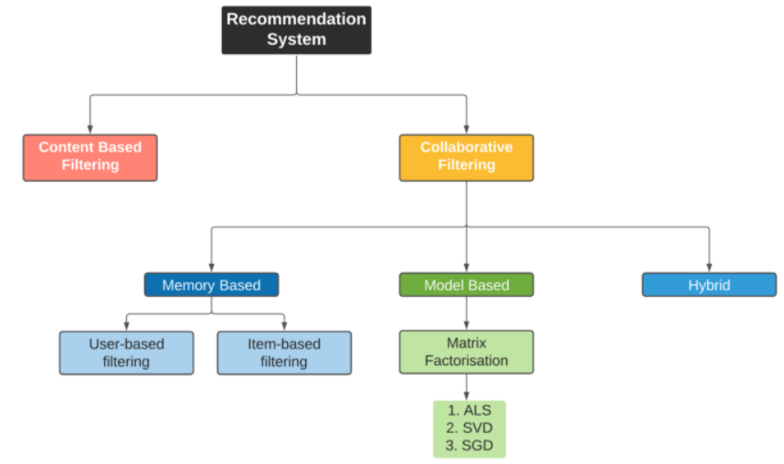
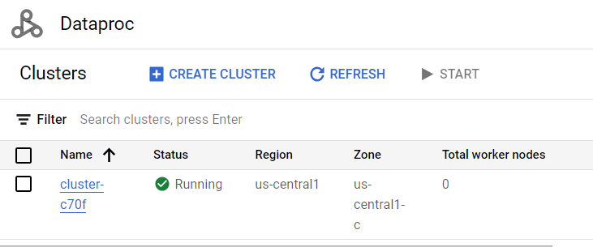
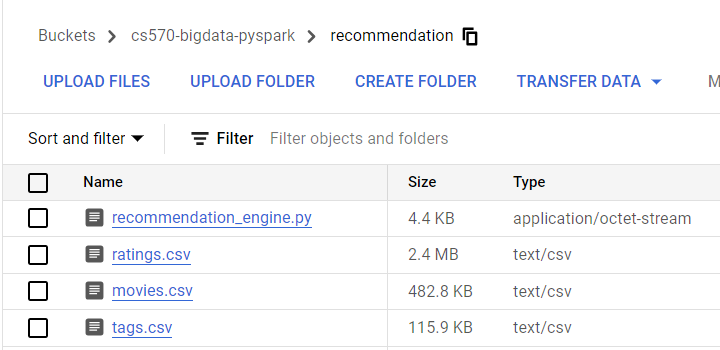
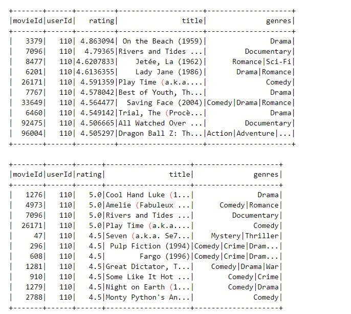

# Recommendation Engine with ALS Model - MovieLens Dataset

## Introduction

This Python program demonstrates the implementation of a recommendation engine using the ALS (Alternating Least Squares) model on the MovieLens dataset. The MovieLens dataset is a popular benchmark dataset for recommendation systems. The program uses PySpark, a Python library for distributed data processing, to perform collaborative filtering and generate personalized movie recommendations for users.

[Movie Recommendation Engine (Google Slides)](https://docs.google.com/presentation/d/1tv-BHW4f2caWLNkfZ-LQ-5Wa0fE4e6Yqy7qyp9fuTE8/edit?usp=sharing)

## Design

The program follows the following steps:

* Load the movie and rating data from CSV files.
* Clean and preprocess the data by converting column types and handling missing values.
* Calculate the sparsity of the ratings dataset to assess the density of ratings.
* Analyze the distribution of ratings by grouping data by userId and movieId.
* Build an ALS model using the PySpark ML library for collaborative filtering.
* Configure hyperparameter tuning using cross-validation to optimize the ALS model.
* Train the ALS model on the training dataset and select the best model based on evaluation metrics.
* Evaluate the performance of the best model on the test dataset using RMSE (Root Mean Squared Error).
* Generate personalized movie recommendations for all users using the best model.
* Merge movie names and genres with the recommendation matrix to improve interpretability.
* Display the recommendations and compare them with the actual ratings for a specific user.

## Implementation

### Prerequisites

- <b>Google Cloud Platform account:</b> Sign up for a Google Cloud Platform account if you don't have one.
- <b>Google Cloud Storage bucket:</b> Create a GCS bucket to store the input data.
- <b> Dataproc cluster:</b> Create a Dataproc cluster with the necessary configuration and access to the GCS bucket.

### Steps

1. Upload the dataset files to the GCS bucket:
   - `ratings.csv`
   - `movies.csv`
   - `tags.csv`

2. Upload the `recommendation_engine.py` script to the same GCS bucket.
   
3. Create a Dataproc cluster on Google Cloud Platform.

* Go to the Google Cloud Console: https://console.cloud.google.com  
* Select your project.  
* In the Navigation menu, click on "Dataproc" under the "Big Data" section.  
* Click on the "Create cluster" button to create a new cluster.  
* Provide the necessary details for your cluster:  
Cluster name: Give a name to your cluster.  
Region: Select the region where you want to create the cluster.  
Zone: Select the zone within the chosen region.  
Cluster type: Choose the appropriate mode for your cluster (Standard or Single Node).  
* Click the "Create" button to create the cluster.  

4. Submit a job using the `recommendation_engine.py` script:
* In the Navigation menu, click on "Dataproc" under the "Big Data" section.  
* Click on the "Jobs" tab. 
* Click on the "Submit job" button to create a new job submission. 
* In the job submission form, provide the necessary information: 
Job id: Name the job. 
Choose the region and cluster. 
Job type: PySpark. 
Main python file: gs://your-bucket-name/recommendation/recommendation.py 
* Click the "Submit" button to submit the job. 

5. Check the output.

