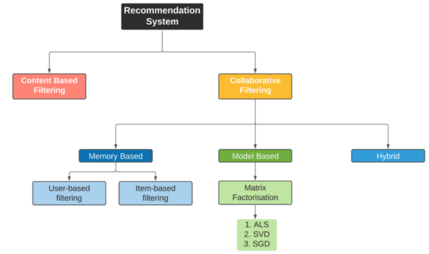
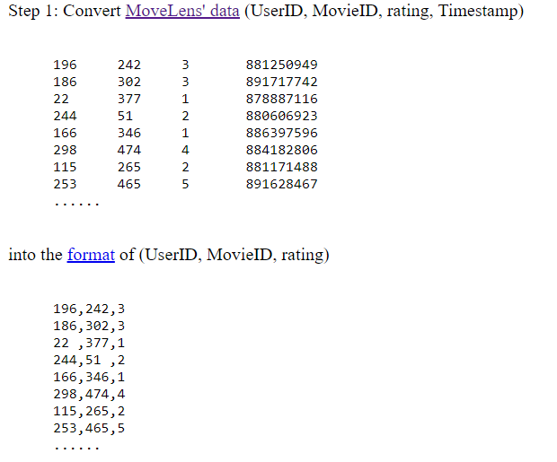
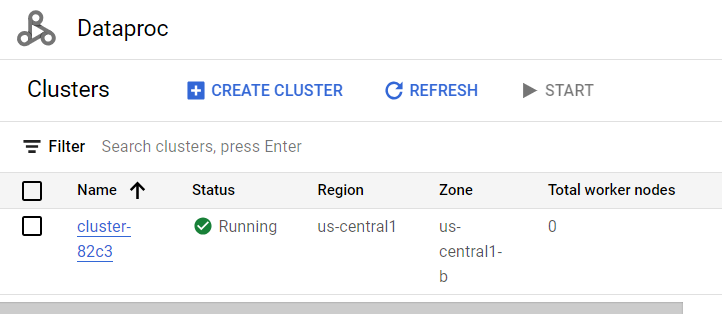
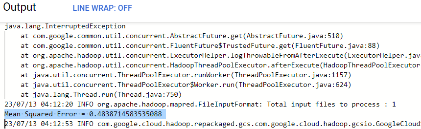

# Movie Recommendation with MLlib - Collaborative Filtering

## Introduction

This project demonstrates the implementation of movie recommendation using MLlib's Collaborative Filtering algorithm in PySpark. The Collaborative Filtering algorithm is widely used for personalized recommendation systems and is based on the idea of predicting user preferences by leveraging the patterns and similarities observed among users and items.

[Movie Recommendation System (Google Slides)](https://docs.google.com/presentation/d/1CQQJXaVyVbbqG-uq-L7P0blJQgjaygumLZlLoGXSjr8/edit?usp=sharing)

## Design

The movie recommendation system follows the Collaborative Filtering approach, which involves the following steps:

1. Loading and parsing the input data: The Movielens dataset containing user ratings is loaded and parsed to create the necessary RDD (Resilient Distributed Dataset) format.

2. Building the recommendation model: The ALS (Alternating Least Squares) algorithm is used to build the recommendation model. ALS is an iterative optimization algorithm that factors the user-item matrix into two lower-rank matrices, representing user and item features. The rank parameter determines the number of features used.

3. Evaluating the model: The model is evaluated using the Mean Squared Error (MSE) metric. MSE measures the average squared difference between the predicted and actual ratings. A lower MSE indicates a better-performing model.

4. Saving the model: The trained recommendation model can be saved to a specified location for future use and deployment.

## Implementation

The implementation involves the following steps:

1. Download the `movielens.txt` file from the GCS bucket:

```
gsutil cp gs://cs570-bigdata-pyspark/movielens.txt .
```
2. Convert the movielens.txt data into the desired format:


```
cat movielens.txt | while read userid movieid rating timestamp; do echo "${userid},${movieid},${rating}"; done > converted_data.txt
```
3. Verify the contents of the converted data:
```
cat converted_data.txt
```
4. Upload the converted_data.txt file to the GCS bucket:
```
gsutil cp converted_data.txt gs://your-bucket-name/recommendation/
```
5. Create a Dataproc cluster on GCP using the GCP Console.



* Go to the Google Cloud Console: https://console.cloud.google.com <br>
* Select your project. <br>
* In the Navigation menu, click on "Dataproc" under the "Big Data" section. <br>
* Click on the "Create cluster" button to create a new cluster. <br>
* Provide the necessary details for your cluster: <br>
Cluster name: Give a name to your cluster. <br>
Region: Select the region where you want to create the cluster. <br>
Zone: Select the zone within the chosen region. <br>
Cluster type: Choose the appropriate mode for your cluster (Standard or Single Node). <br>
* Click the "Create" button to create the cluster. <br>

6. Submit the job using the GCP Console:

* In the Navigation menu, click on "Dataproc" under the "Big Data" section. <br>
* Click on the "Jobs" tab.<br>
* Click on the "Submit job" button to create a new job submission.<br>
* In the job submission form, provide the necessary information:<br>
Job id: Name the job.<br>
Choose the region and cluster.<br>
Job type: PySpark.<br>
Main python file: gs://your-bucket-name/recommendation/recommendation.py<br>
* Click the "Submit" button to submit the job.<br>

7. Check the output.
