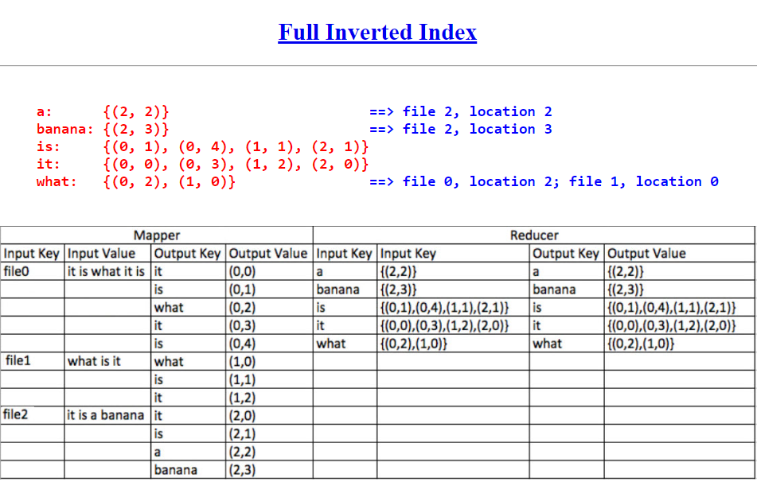
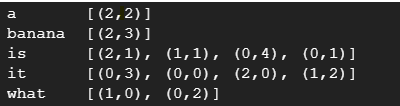

# MapReduce Fully Inverted Index
This repository contains a Java program that implements a fully inverted index using the MapReduce framework. The program takes a collection of text files as input and generates an inverted index, which is a data structure that maps each unique word in the input files to the list of files in which it appears.

[Inverted Index (Google Slides)](https://docs.google.com/presentation/d/19Nw1BS3IHzfDBMZ0l_q4k1pO9YBWSG5_eKVzgwFgAm8/edit?usp=sharing)

## Description
The fully inverted index is a popular data structure used in information retrieval systems. It allows efficient searching and retrieval of documents based on the words they contain. This program utilizes the power of MapReduce to create an inverted index for a given set of text files.

## Design
The program follows the MapReduce design pattern, which consists of two main phases: the Map phase and the Reduce phase.



## Implementation
The implementation of the program involves the following steps:


Change to the project directory:
```
cd repository-name
```
Create the necessary input files:
```
mkdir index
cd index
mkdir input
cd input
vi file0
it is what it is
vi file1
what is it
vi file2
it is a banana
```
Build and execute the MapReduce job:

```
cd ..
cd ..
cd hadoop-3.3.5
bin/hdfs namenode -format
sbin/start-dfs.sh
bin/hdfs dfs -mkdir /user
bin/hdfs dfs -mkdir /user/username
bin/hdfs dfs -mkdir /user/username/index
bin/hdfs dfs -mkdir /user/username/index/input
bin/hdfs dfs -put ../index/input/* /user/username/index/input
bin/hdfs dfs -ls /user/username/index/input
bin/hadoop com.sun.tools.javac.Main ../index/InvertedIndex.java
cp ../index/*.class .
cp ../index/*.java .
jar cf in.jar InvertedIndex*.class
bin/hadoop jar in.jar InvertedIndex /user/username/index/input /user/username/index/output
bin/hdfs dfs -ls /user/username/index/output
bin/hdfs dfs -cat /user/username/index/output/part-r-00000
```

## Test
To test the program, you can provide your own set of input files or modify the existing ones. Make sure the input files are located in the index/input directory.

After executing the MapReduce job, you can check the output by viewing the contents of the part-r-00000 file located in the /user/username/index/output directory. This file contains the fully inverted index generated by the program.

Output will be like:


Feel free to explore and analyze the output to verify the correctness of the fully inverted index implementation.
