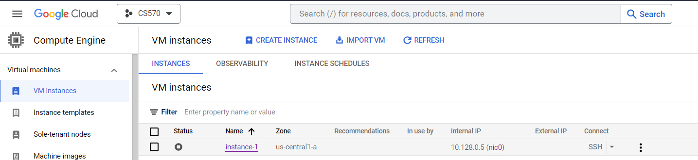
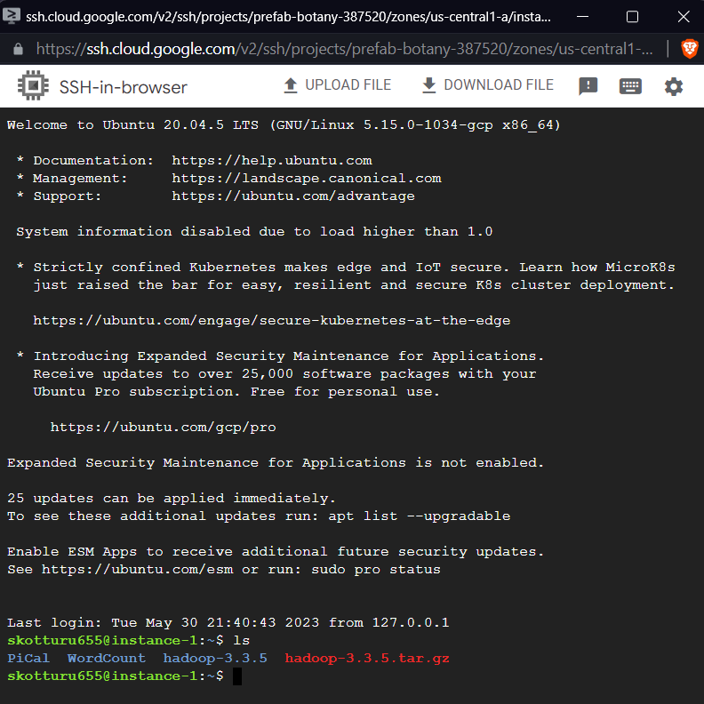
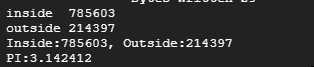

# Project Pi
The objective of this project is to implement a MapReduce model using Hadoop-3.3.5 as the framework for calculating the value of pi.

 [Project Pi (Google Slides)](https://docs.google.com/presentation/d/1tFK3jWo4Eap3z_REZm50LKX_uZ9Ijcsd/edit?usp=sharing&ouid=100644709684739286941&rtpof=true&sd=true)
 
# Description


# Design

* Step 1: Generate an input file for the Pi MapReduce program.

  * 1.1: Develop a Java program that accepts two command-line arguments:
    
    { R: The radius. N: The desired number of (x, y) pairs to generate. }
  * 1.2: Execute the program created in Step 1.1 and store the resulting data in a file. This file will serve as the input for Step 2, the Pi MapReduce program.

* Step 2: Create a MapReduce program, following the structure of the Word Count program, to determine the counts of inside and outside darts.

* Step 3: Utilize the file generated in Step 1.2 as the input for running the MapReduce program developed in Step 2.

* Step 4: Calculate the value of pi within the driver program, using the counts of inside and outside darts obtained from Step 3.


# Implementation

## Requirements

* GCP Environment


* Hadoop environment



* Java environment

## Prepare input data
```
  $ mkdir PiCal
  $ cd PiCal
  $ vi RandomNoGenerator.java
  $ javac RandomNoGenerator.java
  $ java -cp . RandomNoGenerator
```

Input data will store in PiCalculationInput

## Setup passphraseless ssh
Now, make sure you can connect to the localhost using SSH without needing a passphrase.
```
  $ cd hadoop-3.3.5
  $ ssh localhost
```
If you're unable to connect without a passphrase, follow:
```
  $ ssh-keygen -t rsa -P '' -f ~/.ssh/id_rsa
  $ cat ~/.ssh/id_rsa.pub >> ~/.ssh/authorized_keys
  $ chmod 0600 ~/.ssh/authorized_keys
```

Create the necessary HDFS directories for running MapReduce jobs and copy the input data into HDFS.
```
  $ cd ..
  $ cd hadoop-3.3.5
  $ bin/hdfs namenode -format
  $ sbin/start-dfs.sh
  $ wget http://localhost:9870/
  $ bin/hdfs dfs -mkdir /user
  $ bin/hdfs dfs -mkdir /user/username
  $ bin/hdfs dfs -mkdir /user/username/PiCal
  $ bin/hdfs dfs -mkdir /user/username/PiCal/input
  $ bin/hdfs dfs -put ../PiCal/PiCalculationInput /user/username/PiCal/input
```
 If you're unable to copy the input data into the Hadoop directory, restart the virtual machine.

## Prepare code

* Build the PiCalculation Java file.
```
  $ cd hadoop-3.3.5
  $ vi PiCal.java      
```

* Compile the PiCalculation.java file and generate a JAR file.
```
  $ bin/hadoop com.sun.tools.javac.Main PiCal.java
  $ jar cf wc.jar PiCal*class  
```

## Run

* Execute
```
  $ bin/hadoop jar wc.jar PiCal /user/username/PiCal/input /user/username/PiCal/output
```

* Output
```
  $ bin/hdfs dfs -ls /user/username/PiCal/output
  $ bin/hdfs dfs -cat /user/username/PiCal/output/part-r-00000 
```

* Stop
```
  $ sbin/stop-dfs.sh
```

## Test Result

Test Case:

How many random numbers to generate: 1000000
Radius = 200



