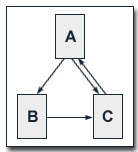
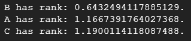

# PageRank
The objective of PageRank is to assign a numerical importance score to each webpage in a web graph based on its connectivity and the importance of the pages linking to it. The algorithm aims to determine the significance and relevance of web pages within the overall network of interlinked pages.

 [PageRank (Google Slides)](https://docs.google.com/presentation/d/1IHXHAz43QLiH9H2HWAQXNT7e_2Lx1HDQ/edit?usp=sharing&ouid=100644709684739286941&rtpof=true&sd=true)
 
# Introduction

PageRank, is an algorithm developed by Larry Page and Sergey Brin, the founders of Google. PageRank is a fundamental component of web search and plays a vital role in determining the relevance and importance of web pages.

At its core, PageRank is designed to address the challenge of organizing and ranking the vast amount of information available on the internet. The algorithm assigns a numerical value, known as the PageRank score, to each web page. This score represents the importance and authority of the page in the web graph. The more high-quality and authoritative pages that link to a particular page, the higher its PageRank score.


# Design


The Process of Calculating PageRank :

* Initialize each page's rank to 1.0:

At the beginning of the algorithm, assign an initial rank of 1.0 to every page in the web graph.

* Iterative contribution calculation :

On each iteration, each page (p) sends a contribution of rank(p) divided by the number of neighbors (pages it has links to) to its neighbors.
The contribution represents the proportion of the current page's rank that it distributes to its neighboring pages.
* Update each page's rank :

After receiving contributions from its neighbors, each page's rank is updated using the formula: rank = 0.15 + 0.85 * contributionsReceived.

**Note:**

The damping factor of 0.85 is applied to balance the contribution of incoming ranks with the base rank of 0.15.

The damping factor ensures that not all the rank is distributed, helping to avoid overemphasis on highly connected pages.

The more Input Web Pages the better.

The higher PageRank of an Input Web Page the better.

# Implementation

## Requirements

* DataProc on GCP:


I wanted to find the pagerank of A,B,C in the following image:

 

So, my input.txt is:

A B <br>
A C <br>
B C <br>
C A <br>

## To create and save the spark job python file:
1. In the top right corner of the console, click the Activate Cloud Shell button.
2. Once the Cloud Shell is activated, click on the Open Editor button in the top right
corner of the Cloud Shell window.
3. Click on the new file icon beside your username to create a new file.
Here’s the Python code, I used:

Save the file. I saved it as pagerank.py and close the shell. 


## To Run the <b>PySpark</b> Job on Google Cloud Dataproc :

* **Step 1:** Click on activate cloud shell like we did previously. Authenticate with Google Cloud Platform (GCP)
If you encounter an authentication error, run the command:
```
gcloud auth login
```
This command will open a web page where you can authenticate and obtain new credentials.
Follow the on-screen instructions to complete the authentication process.
Click on the click, authorize, and copy the code. Paste the same code in the authentication
code.

* **Step 2:** Submit the PySpark job to Dataproc
```
$ gcloud dataproc jobs submit pyspark pagerank.py --cluster=<cluster-name> --region=<region-of-cluster> -- <path-of-input-file-from-bucket> <number-of-iterations>
```
This step 2 command submits a PySpark job named pagerank.py to the Dataproc cluster

* **Step 3:** See the output

Output Sample:


## To Run the <b>Scala </b> code Google Cloud Dataproc SSH :

* **Step 1:** Connect to SSH
1. Go to the Dataproc Cluster details page.
2. Locate the cluster you created and click on the "SSH" button to open a terminal window.

* **Step 2:** Execute the following commands in the SSH terminal:

Download and setup `cs` (Coursier):
```
$ curl -fL https://github.com/coursier/coursier/releases/latest/download/cs-x86_64-pc-linux.gz | gzip -d > cs && chmod +x cs && ./cs setup
```
Set SCALA_HOME environment variable and add SCALA_HOME to the PATH::
```
$ export SCALA_HOME=/usr/local/share/scala
$ export PATH=$PATH:$SCALA_HOME/
```
Create an input text file named input.txt and add the input data using a text editor:

My input.txt is provided in the requirements above.

```
vi input.txt
```
Create a directory on HDFS and upload the input file. Then verify the file uploaded.
``` 
$ hdfs dfs -mkdir hdfs:///mydata
$ hdfs dfs -put input.txt hdfs:///mydata
$ hdfs dfs -ls hdfs:///mydata 
```

The last command should show the `input.txt` file in the `mydata` directory on HDFS.

* **Step 4:** Run the PageRank Code
1. Run the following command to start the Spark shell:
```
$ spark-shell
```
2. Once the Spark shell is started, copy and paste the contents of the `pagerank.scala` file into the shell.
3. Press Enter to run the code.
4. After the code execution, you will see the output with ranks for each key.

Output: 
