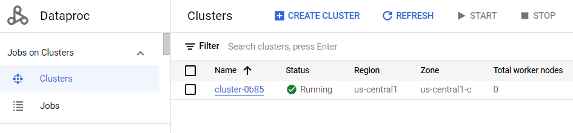
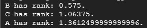

# PageRank
The objective of this project is to implement a distributed computing model using PySpark on Google Cloud Platform (GCP) for calculating the value of pi.

 [Project Pi (Google Slides)](https://docs.google.com/presentation/d/1kydfigjA3PDWXfdRqKuzpYE8SLluslSmDUxsk6vPMkY/edit?usp=sharing)
 
# Description

PageRank,is  an algorithm developed by Larry Page and Sergey Brin, the founders of Google. PageRank is a fundamental component of web search and plays a vital role in determining the relevance and importance of web pages.

At its core, PageRank is designed to address the challenge of organizing and ranking the vast amount of information available on the internet. The algorithm assigns a numerical value, known as the PageRank score, to each web page. This score represents the importance and authority of the page in the web graph. The more high-quality and authoritative pages that link to a particular page, the higher its PageRank score.


# Design


The Process of Calculating PageRank:

* Initialize each page's rank to 1.0:

At the beginning of the algorithm, assign an initial rank of 1.0 to every page in the web graph.

* Iterative contribution calculation:

On each iteration, each page (p) sends a contribution of rank(p) divided by the number of neighbors (pages it has links to) to its neighbors.
The contribution represents the proportion of the current page's rank that it distributes to its neighboring pages.
* Update each page's rank:

After receiving contributions from its neighbors, each page's rank is updated using the formula: rank = 0.15 + 0.85 * contributionsReceived.

**Note:**

The damping factor of 0.85 is applied to balance the contribution of incoming ranks with the base rank of 0.15.

The damping factor ensures that not all the rank is distributed, helping to avoid overemphasis on highly connected pages.

The more Input Web Pages the better.

The higher PageRank of an Input Web Page the better.


# Implementation

## Requirements

* DataProc on GCP:


## To create and save the spark job python file:
1. In the top right corner of the console, click the Activate Cloud Shell button.
2. Once the Cloud Shell is activated, click on the Open Editor button in the top right
corner of the Cloud Shell window.
3. Click on the new file icon beside your username to create a new file.
Here’s the Python code, I used:

Save the file. I saved it as pi.py and close the shell. 


## To Run the PySpark Job on Google Cloud Dataproc :

* **Step 1:** Click on activate cloud shell like we did previously. Authenticate with Google Cloud Platform (GCP)
If you encounter an authentication error, run the command:
```
gcloud auth login
```
This command will open a web page where you can authenticate and obtain new credentials.
Follow the on-screen instructions to complete the authentication process.
Click on the click, authorize, and copy the code. Paste the same code in the authentication
code.

* **Step 2:** Submit the PySpark job to Dataproc
```
$ gcloud dataproc jobs submit pyspark pagerank.py --cluster=<cluster-name> --region=<region-of-cluster> -- <path-of-input-file> <number-of-iterations>
```
This step 2 command submits a PySpark job named pagerank.py to the Dataproc cluster

* **Step 3:** See the output

OUTPUT:




