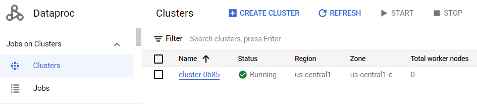
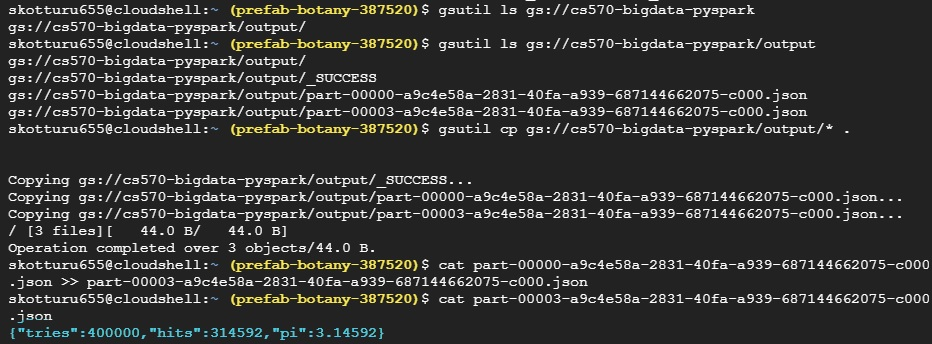

# Project Pi
The objective of this project is to implement a distributed computing model using PySpark on Google Cloud Platform (GCP) for calculating the value of pi.

 [Project Pi (Google Slides)](https://docs.google.com/presentation/d/1tFK3jWo4Eap3z_REZm50LKX_uZ9Ijcsd/edit?usp=sharing&ouid=100644709684739286941&rtpof=true&sd=true)
 
# Description


# Design

To calculate the value of pi, follow these steps:
1. Take a random position (x, y) inside a square.
2. Determine whether the (x, y) pair falls inside or outside the circle. Assign a value of 1 if it's inside and 0 if it's outside.
3. Count the number of positions that fall inside the circle (S) and the total number of positions (N) on the square board.
4. Use the formula pi = 4 * (S/N) to calculate the value of pi.


# Implementation

## Requirements

* DataProc on GCP:


## To create and save the spark job python file:
1. In the top right corner of the console, click the Activate Cloud Shell button.
2. Once the Cloud Shell is activated, click on the Open Editor button in the top right
corner of the Cloud Shell window.
3. Click on the new file icon beside your username to create a new file.
Here’s the Python code, I used:

Save the file. I saved it as pi.py and close the shell. 


## To Run the PySpark Job on Google Cloud Dataproc :

* **Step 1:** Click on activate cloud shell like we did previously. Authenticate with Google Cloud Platform (GCP)
If you encounter an authentication error, run the command:
```
gcloud auth login
```
This command will open a web page where you can authenticate and obtain new credentials.
Follow the on-screen instructions to complete the authentication process.
Click on the click, authorize, and copy the code. Paste the same code in the authentication
code.

* **Step 2:** Submit the PySpark job to Dataproc
```
gcloud dataproc jobs submit pyspark pi.py --cluster=<cluster-name> --region=<region-of-cluster> -- --partitions <no-of-partitions>  <output-uri-path>
```
This step 2 command submits a PySpark job named pi.py to the Dataproc cluster

* **Step 3:** List the files in the output directory
```
gsutil ls gs://<name-of-gcp-bucket>/output/
```
This command lists the files present in the gs://bucketname/output/ GCS bucket directory.


* **Step 4:** Copy the output files to the current directory
```
gsutil cp gs://<name-of-gcp-bucket>/output/* .
```
This command copies all the files from the gs://bucketname/output/ GCS bucket directory to the current directory in the Cloud Shell environment.

* **Step 5:** Combine the contents of part-00000 and part-00003 files
```
cat part-00003 >> part-00000
```
This command appends the contents of the part-00000 file to the end of the part-00003 file.

* **Step 6:** See the output
```
cat part-00003
```

OUTPUT:



